# 1701QCA Making Interaction - Assessment 2 workbook

You will use this workbook to keep track of your progress through the course and also as a process journal to document the making of your projects. The comments in italics throughout the template give suggestions about what to include. Feel free to delete those instructions when you have completed the sections.

When you have completed the template, submit the link to the GitHub Pages site for this repository as a link in Learning@Griffith. The link should be something like [https://qcainteractivemedia.github.io/1701QCA-Assessment2/](https://qcainteractivemedia.github.io/1701QCA-Assessment2/) where `qcainteractivemedia` is replaced with your GitHub username and `1701QCA-Assessment2` is replaced with whatever you called the repository this template is contained in when you set it up.

## Project working title ##
As of right now, the name of my project is Project Bit Buddy.

## Related Projects ##

### Related Project 1 ###
Dusk to Dawn: Sleep and Wake Up Lamp
*(Sourced from http://idprojects.rmit.edu.au/project/dusk-to-dawn-sleep-and-wakeup-lamp/)*

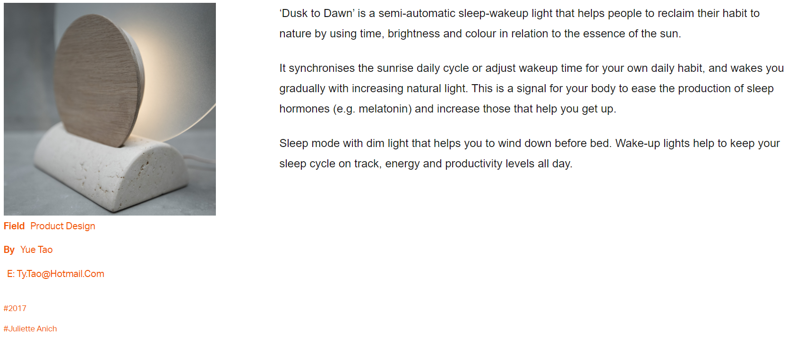

This project is related to mine because it uses coding methods that respond to time with light and colour.

### Related Project 2 ###
Mood Reflecting Floor

*(Sourced from https://www.youtube.com/watch?v=JOg4chJAgn8)*

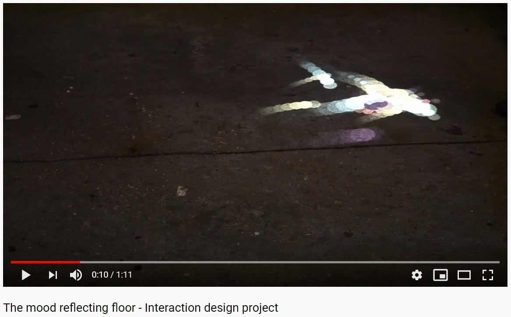

This project is related to mine because it reacts and responds to input from its user.

### Related Project 3 ###
medicube: Smart medication dispenser with voice assistant

*(Sourced from https://interactiondesign.sva.edu/projects/medicube)*

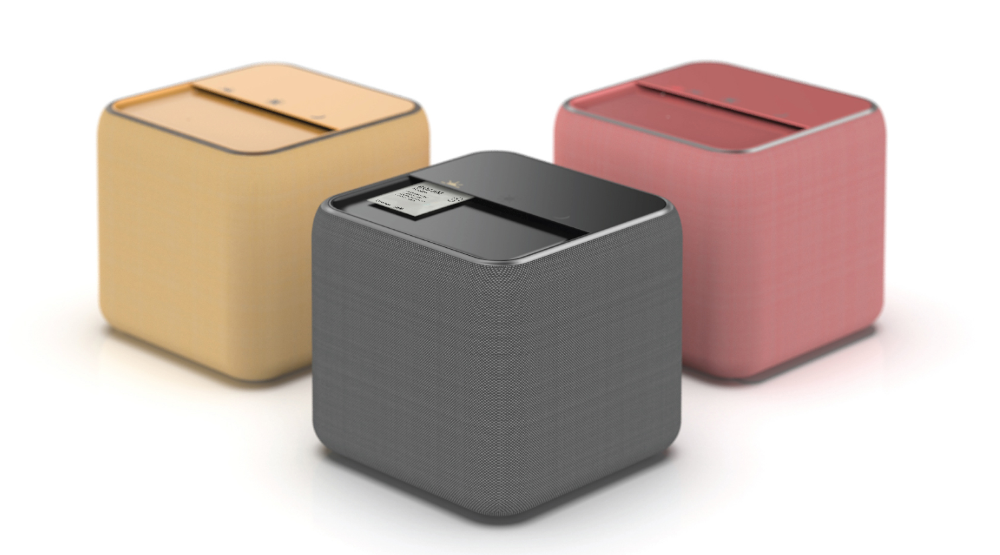

This project is related to mine because It uses processes such as timers and audio output in response to the users' needs and/or preferences.

## Related Projects 4-6 are located under initial design concepts ##

## Conceptual progress ##

### Design intent ###
An interactive children’s toy that responds to light, touch and movement.

### Design Concepts ###
For my initial design concepts, I wanted to explore multiple avenues and different types of operations all-together.

### Design concept 1: Study Buddy ###
A device that allows students or workers to work efficiently with an interval alarm system. It allows the user to work for 30 minutes, then sounds an alarm and informs the user to take a break, and after 5 minutes sounds another alarm, indicating that the user should start working again. The process repeats for no more than 3 hours, then a different alarm sounds, informing the user that they have been studying enough for one sitting. 
The device has two options; Study 30 min : Break 5 min or; Study 60 min : Break 15 min.
Pins 1 and 2 can be pressed to select the setting. The device has to be turned upside down and back upright for the alarm to stop. Buttons A and B are the On and Off buttons. 
It allows people to study at a decent pace, allowing them to have small breaks and doesn’t make them work too hard.

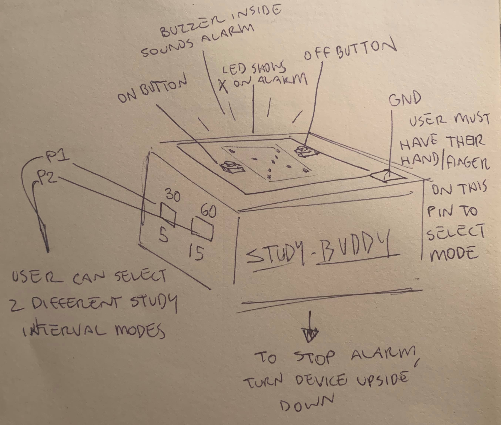

There is an interesting website, Tomato Timer, that allows users to start and stop it whenever they want and also allows them to take either short (5 mins) or long (10 mins) breaks. The design is a lot more sophisticated than my micro:bit version idea, but it shares the same foundational concept.

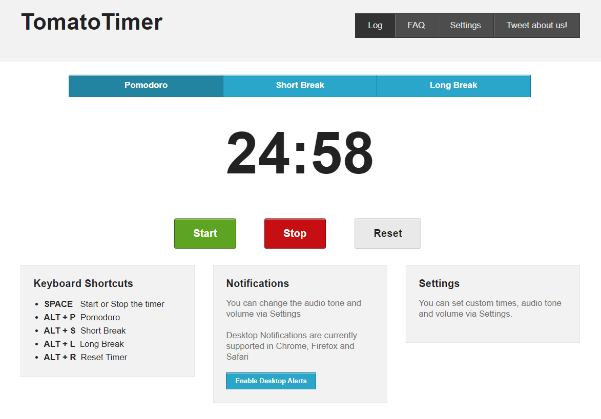

*(Sourced from https://tomato-timer.com/)*

### Design concept 2: Timely Snacks ###
A snack dispenser that only dispenses every half hour. Similar to the Study Buddy idea, it gives the user an incentive to work towards. It would be most effective with a younger audience in order to teach them about productivity and incentivising. This concept is commonly found in food bowls for pets that dispense a certain amount of food for the animal to eat at a certain time of the day. Instead of using pellet food, candy or chocolate bars would be used for this device.

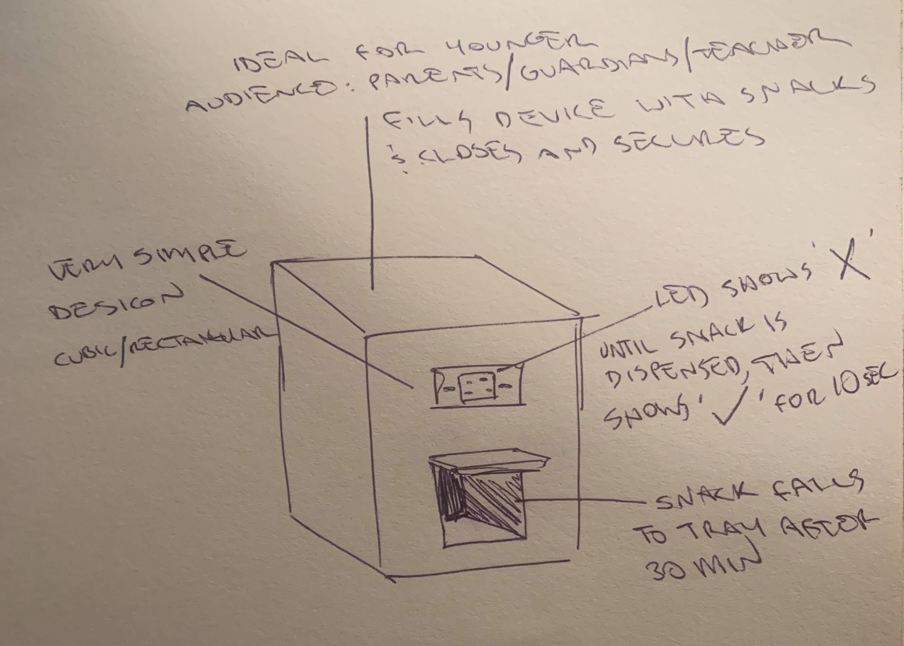

The timed snack dispenser draws inspiration from machines commonly used for pet cats and dogs. It dispenses the animals’ food at a certain time of day, which is adjustable by the user. The idea makes the device seem trivial, but it could work to help people be more productive with their work.

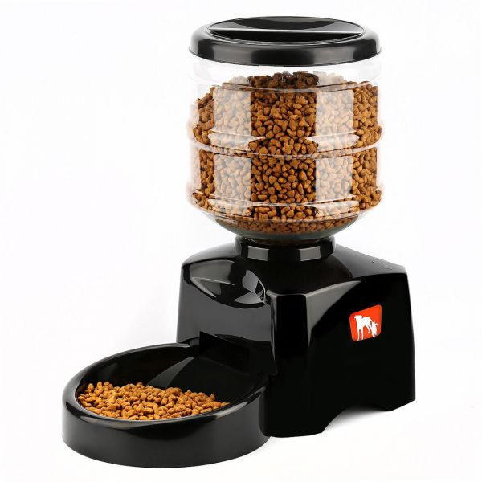

*(Sourced from https://www.amazon.ae/Automatic-Dispenser-Station-Programmable-Portion/dp/B07MQ2H996?ref=SQAE-WEB-DP301)*

### Design concept 3: Alarm Box ###
Alarm box: A box that has a specific opening method, and when tried to open the wrong way, sounds an alarm for 10 seconds. The user must open the box in a certain way in order to successfully unlock it and gain access to its contents. Three failed attempts causes the box to lock temporarily for 1 day, disabling the possibility of unlocking it a fourth time. The alarm sound would be produced by a simple buzzer and an LED ‘X’ would flash on the display. The idea stems from the concept behind a simple safe, and a more creative version, a puzzle box. The owner could store any of their private possessions in the box, for example, a journal, spare keys or special items.

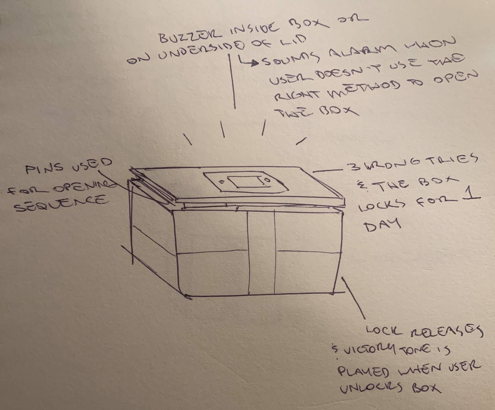

Puzzle boxes are quite stimulating and I’ve always found them interesting, which is why I considered one for this project. I’ve drawn inspiration from two concepts: A lock and key system, and a more complicated, more creative puzzle system, where the user has to open the box in a very specific way or an alarm will sound and the box will remain locked. This box below is a great example of the idea, but doesn’t have the alarm.

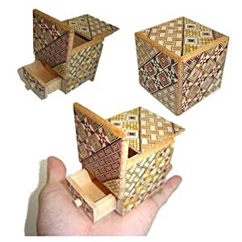

*(Sourced from https://www.amazon.com/Sun-Steps-Cube-Secret-DRAWER/dp/B009QEUNWG)*

### Final design concept ###
One idea that I was leaning more towards was an interactive toy that could recognise and respond to multiple types of input like light, touch and movement. The idea was to create a creature (similar to a dog or a teddy bear) that seemed to have an ability to change mood, and make certain faces, noises and movements in response to particular input. For example, if someone was to shake the toy, a sad or distressed face would appear on the LED display and a tone or a series of tones would play as well. 
Response to light: If the toy is placed in a dark place it will become distressed and play an alarm-like sound, signalling to its owner to take it to a well-lit area. 
Response to touch: There is a foil band that reaches around the body of the toy, where the user’s hand would be if they were holding it. There are also two other foil pieces, one located on the top of the head and one located on the stomach. If the user has their hand on the band, they can touch one of the other pieces to pat the toy and it will show a happy face and play a playful series of tones.
Response to movement: When the toy is shaken, a distressed face appears on the LED display and a sad series of tones is played. 
All of these characteristics of the device are intended to give the toy a personality and a sense of aliveness, as if it is a real pet with feelings. 
Buttons A and B are the On and Off buttons, respectively.
Another aspect I want to add to the toy is a wagging tail to indicate that the toy is happy. When the user pats the toy, it wags its tail.

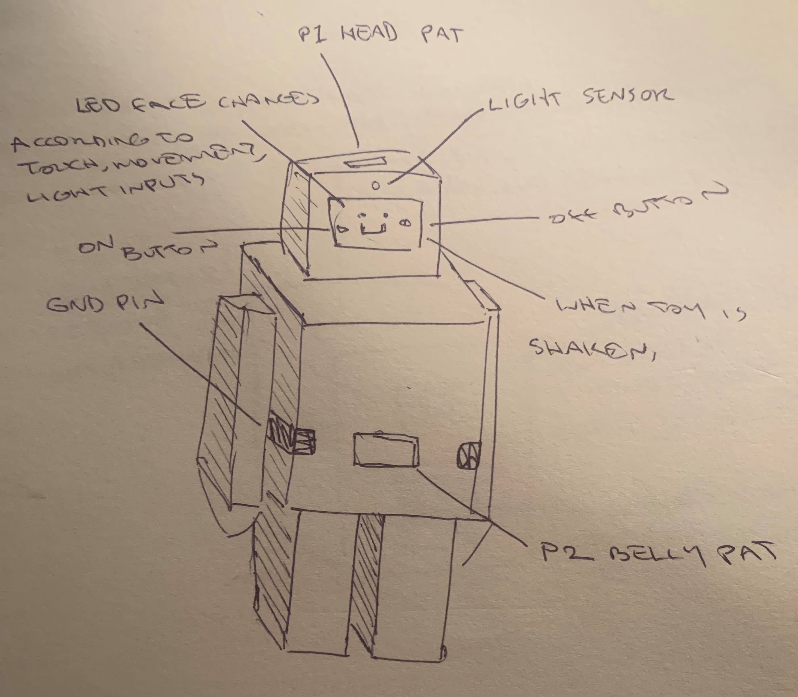

After narrowing down my interactive toy idea, I wanted to look online to see if there were some good examples of micro:bit pet toys. Unsurprisingly, there were quite a lot. The pictures below are a little different to my specific idea, but the basic elements are similar and the information provided with the images gives me a good foundation to start from for my own device. 

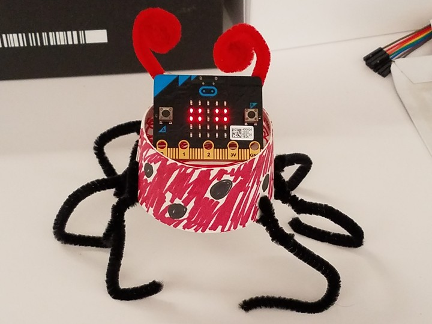

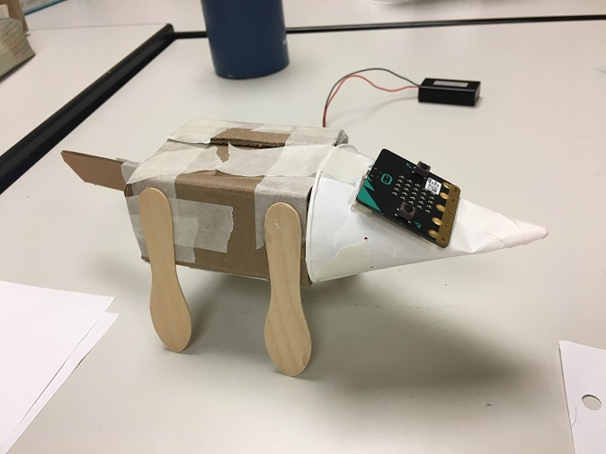

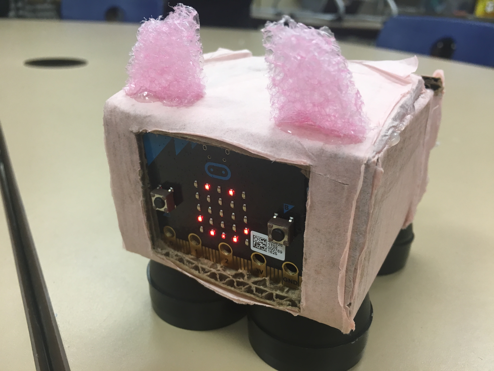

*(Sourced from https://makecode.microbit.org/courses/csintro/making/project)*

### Interaction flowchart ###

## Physical experimentation documentation ##

*In this section, show your progress including whichever of the following are appropriate for your project at this point.
a.	Technical development. Could be code screenshots, pictures of electronics and hardware testing, video of tests. 
b.	Fabrication. Physical models, rough prototypes, sketches, diagrams of form, material considerations, mood boards, etc.
Ensure you include comments about the choices you've made along the way.*

Coding first: I wanted the prototype to have a range of responses to input, so it would be fun to operate. This required quite a bit of coding, as shown below. It didn't take too long to finish this particular code because it consists of mainly the basic processes we learned near the start of the trimester. I tried to include some more complicated coding that I'd sourced off the internet, but none of them worked. I relied a little on the micro:bit booklet instead, and recapped in-class activities I have done in the past.

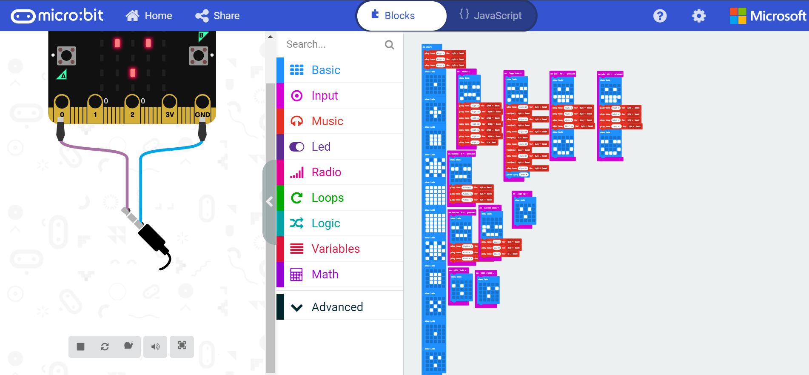

After the code was set up, I could start constructing the prototype around the micro:bit. I ordered alligator clips online specifically for this assessment, but they never arrived, so I had to keep the breadboard included in the design, which makes it a bit chunky.

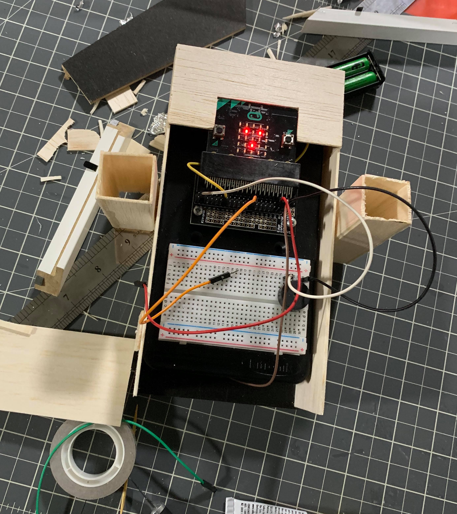

The longest part of this whole process was the construction. I used a lot of balsa wood, aluminium foil and pva glue. After a while, I realised that pva glue can take a little while to dry completely and I wasn't very patient with it. I kept trying to work on the prototype and assemble it while the glue was still wet, causing it to fall apart very easily. Eventually I switched it out for super glue, which was much more efficient.

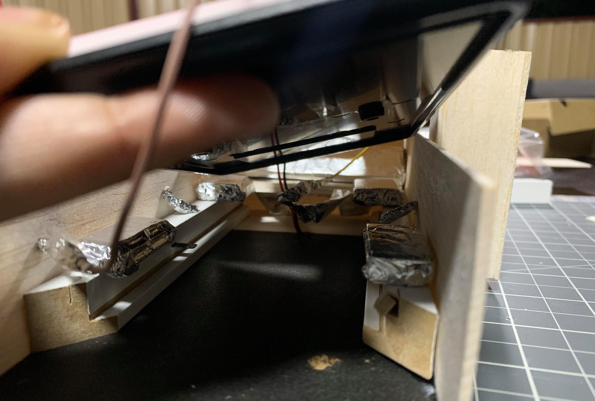

The inside was also a bit tricky, as I had to keep the micro:bit in a specific position and secure it there, so I had to fiddle around with layering the balsa wood and foil to keep it elevated. 

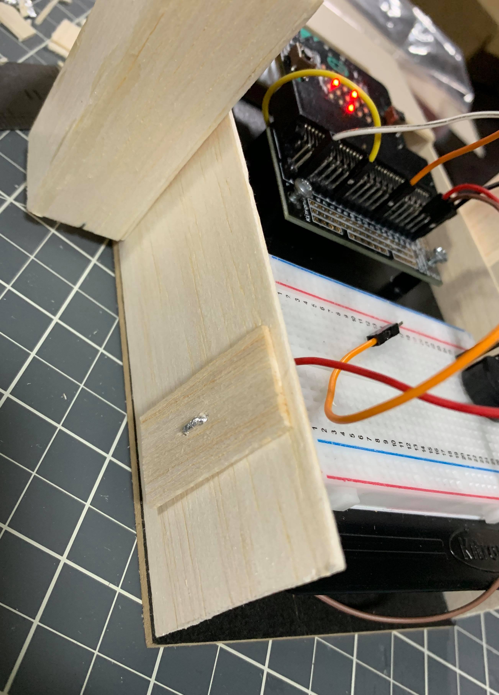

The little wire piece on the side of the prototype is connected to the ground pin and is where the user must place one of their hands before touching either of the other pins. 

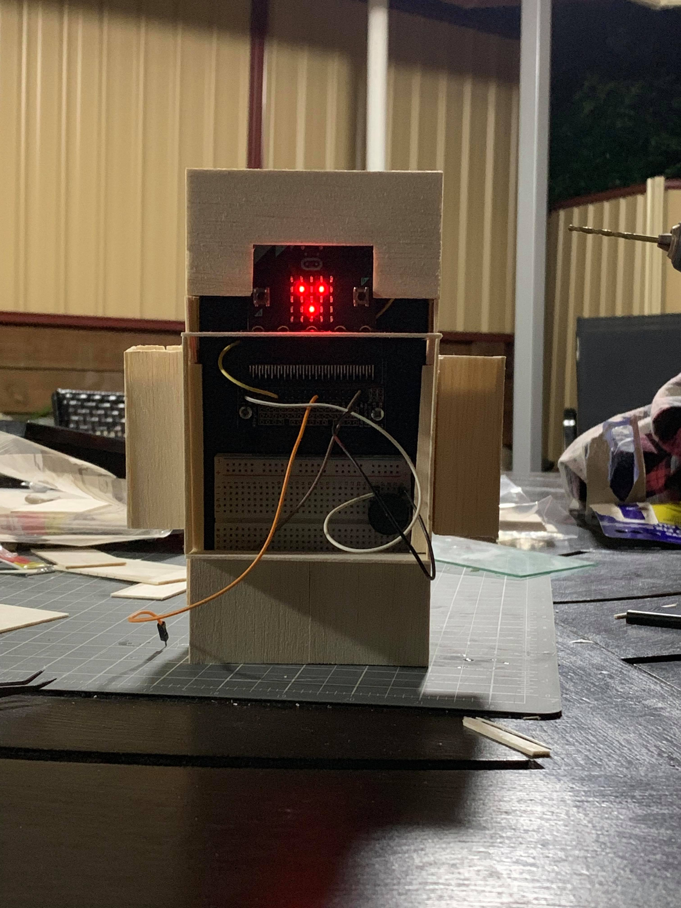

At this point, the construction was almost complete and I had figured out a way to secure the micro:bit while also being able to move it if I needed to re-program it. I couldn't remove it at this point because all the wires were connected with the prototype's pieces.

## This is the finished prototype ##

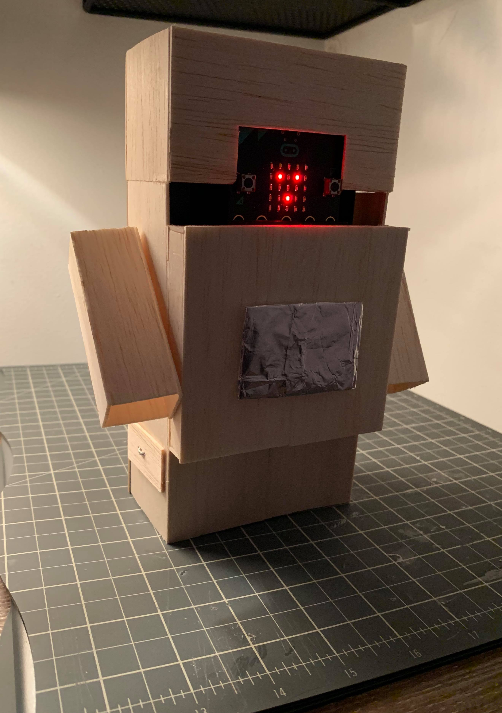
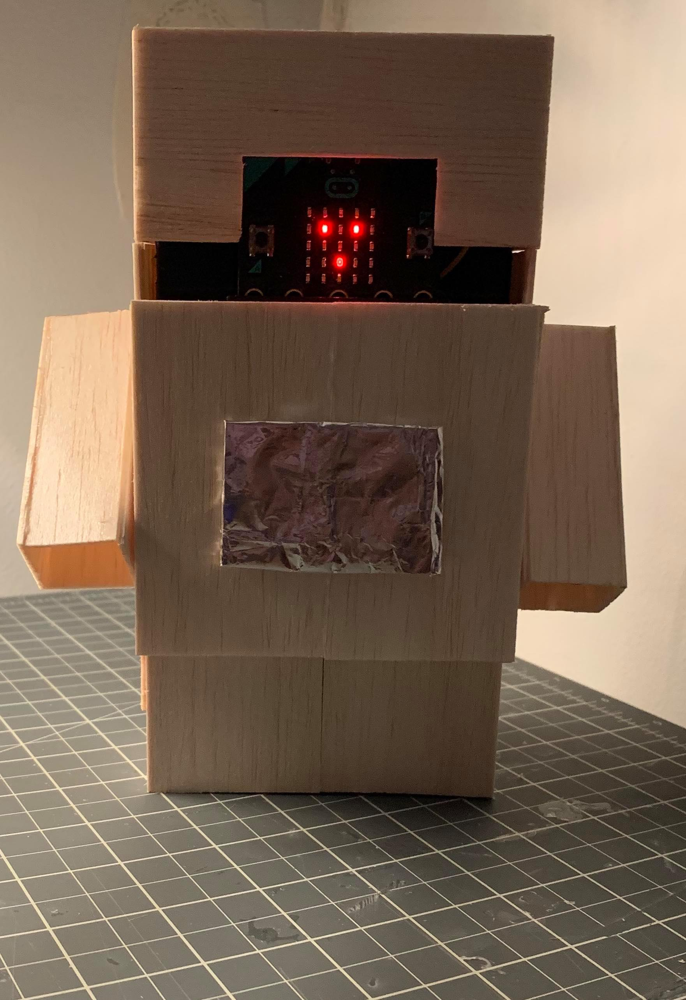

The prototype can display different facial expressions to indicate its mood.

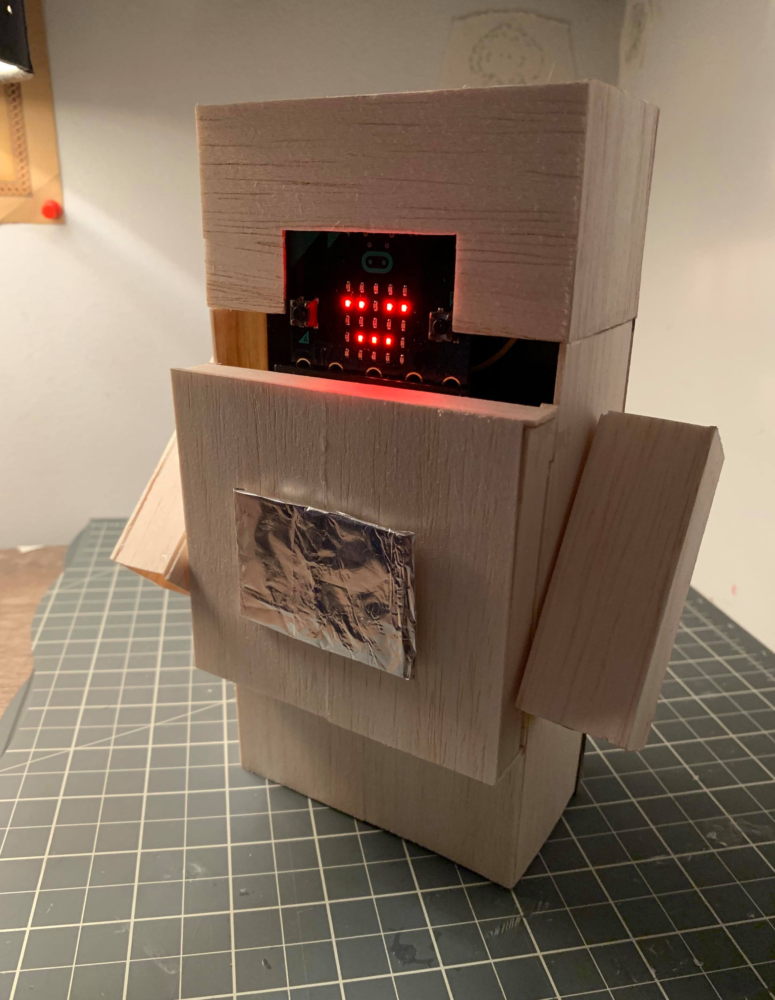
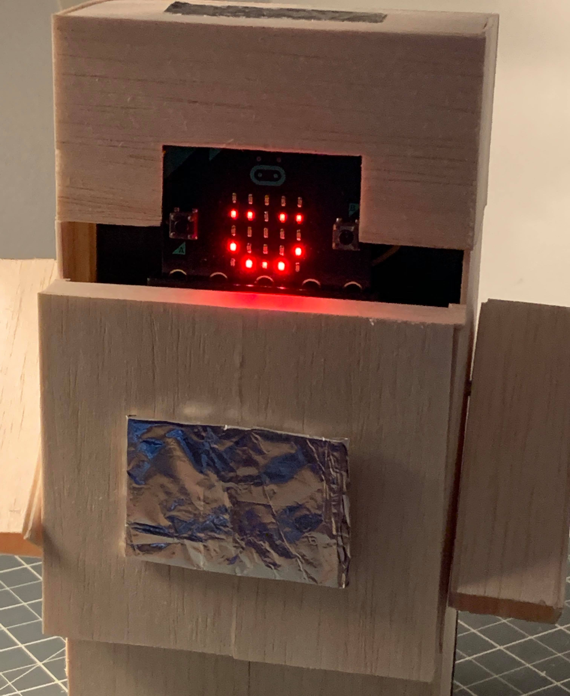

I have uploaded a video demonstrating how the prototype works on the Learning@Griffith submission point.

## Design process discussion ##

My first step for this assessment was to look online for interactive art and media projects that I found interesting. After exploring multiple avenues, I narrowed down my choices and established my idea in its most basic form. From there, I worked on the interaction flowchart to figure out how I wanted the device to operate. I had a few ideas as to what it would do (as mentioned in previous sections) and I tried to make them work. Unfortunately, after many rounds of trial and error I could only get one of my multiple ideas to work at a time. Because of this issue, I had to work with a limited amount of options. I made the most of it and tried to make the prototype do as much as it could with its restrictions.
The construction of the physical prototype was a long process that included a couple failed attempts, but overall, it wasn't too hard to do. It was only time-consuming.
There were still two aspects of the design that I couldn't incorporate into the protoype, because I could not figure out the coding for them. I was really hoping for the toy to be able to respond to light, but I wasn't able to have the buzzer and the light sensor working at the same time. 
I also would have liked to make the prototype smaller, and not have had to use the breadboard, but I did not receive my alligator clips in time. Unfortunately, I had to work with what I had but that being said, I think the prototype still turned out nice.

## Next steps ##

Now that I have a working prototype, the next things I will do moving forward are trying to get the light sensor to work, and replacing the large breadboard with alligator clips, which will allow me to make a smaller device and it will also be able to respond to a lot more types of input.
I want to improve the aesthetic of the prototype as well, because balsa wood and aluminium foil don't make the device look very resolved. My hopes for the final outcome are that it will either look like a teddy bear or a unique style character that I design myself. I will do more research and brainstorming on different types of fabrics/materials I can use to make this possible. 
It should also be noted that the micro:bit was very hard to move and could not be removed from the prototype once it was fully constructed. When I make the final outcome, I want the micro:bit to be easily accessible and easily removed.
